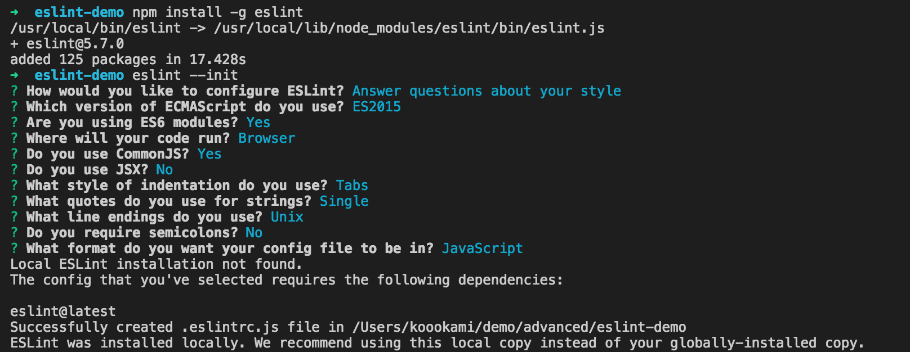

## 基本使用 
1. 安装 `npm install -g eslint`
2. 初始化 `eslint --init`

 - 使用哪种方式配置eslintrc
 - 使用es几来编译
 - 使用es6模块导出/入？
 - 代码的运行环境
 - 使用commonjs
 - 使用jsx
 - space 还是 tabs
 - 单双引号
 - 电脑的环境
 - 是否需要分号
 - 生成的rc为什么格式的文件
3. 编写忽略文件
4. 在 package.json中添加命令

   - `eslint 要检测的目录`

## 基本操作
> 配置完成后，执行脚本可以检测代码是否规范
>
> 如果报错非常多的情况可以在package.json配置命令
>
> `eslint --fix 要检测的目录`
>
> 会将一些能自动更改的项进行更改，但无法全部更改为正确的详见官网。

## eslintrc

```js
module.exports = {
    "env": { // 启用各环境的顶级全局变量
        "browser": true,
        "commonjs": true,
        "es6": true // 
    },
    // "parser": "eslint:recommended",
    "parserOptions": {
        "ecmaFeatures": {// 添加需要的额外语言特性
            "jsx": true,
            // "globalReturn": true, // 允许在全局作用域下使用 return 语句
            // "impliedStrict": true, // 启用全局 strict mode (如果 ecmaVersion 是 5 或更高)
            // "experimentalObjectRestSpread": true, // 对  ... (对象拓展运算符)语法的支持 已弃用
        },
        "ecmaVersion": 5, // 启用不同版本的js语法支持 默认3，5. 可选 6，7，8，9
        "sourceType": "module"  // 导入模块类型 script/module
    },
    "rules": {// 所有校验的规则配置
        "indent": [
            "error",// 错误级别 0(off) 1(warn) 2(error) => 不用 警告 报错
            4
        ],
        "linebreak-style": [
            "error",
            "unix"
        ],
        "quotes": [
            "error",
            "single"
        ],
        "semi": [
            "error",
            "never"
        ],
        // "no-console": [0],
        // "extends" 用来拓展配置的 可以是 "" 也可以是 ["",""]
        // "extends": "esprima", // 设置eslint的解析器默认是esprima，可选 Babel-ESLint typescript-eslint-parser(实验)
        // "extends": "eslint:recommended" // 加上这行，那么 https://cn.eslint.org/docs/rules/ 里所有打勾的规则都会应用
    },
    "globals": { // 这里定义的k，在检查代码时遇到为定义的全局变量不会报错
        "var1": true,// 允许重写 var1 变量
        "var2": false
    },
    "plugins": [ // 放置eslint 插件， 可以省略插件名称的 eslint-plugin- 前缀

    ]
    /**
     * extends用来添加额外的配置
     * plugins用来添加额外的插件
     */
};
```
### 块注释
```js
// 这是一个注释对，包含在内的代码不会被校验
/* eslint-disable */

alert('foo');

/* eslint-enable */

```
> 仅不校验某些规则的写法如下

>  仅不校验alert和console 但是写了 ; 还是报错

> 如果不写eslint-enable来结束，那么eslint-disable以下的代码都不校验

```js

/* eslint-disable no-alert, no-console */

alert('foo')
console.log('bar');

/* eslint-enable no-alert, no-console */

/* eslint-disable */
// 以下均不校验

```

## 拓展

- pre-commit

> 在git提交之前拦截一下，可以指定必须执行某项命令通过了才可提交
>
> 安装 `npm i pre-commit -D`

在package.json中添加一项

```js
{
  "scripts": {
    "test": "echo \"Error: no test specified\" && exit 1",
    "lint": "eslint src",
    "fix": "eslint --fix src"
  },
  "pre-commit": [
  "test": true
  ]
}

```
> 只有在package.json同级的git提交，pre-commit 才会生效。


